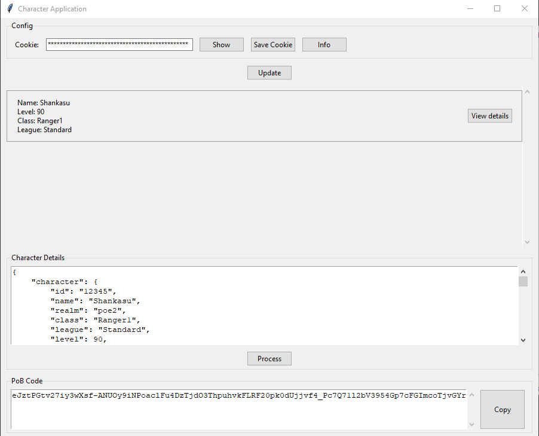

# PoB-2-Importer
Just an importer from the Maxroll API to PoB.

If you want, you can compile or execute the file codeall.py. Otherwise, if you just want to compile, click compile.bat.

If you want to try the app, simply execute pob2importer.exe.

Please note that I have not created all the characters in the game, so there may be errors. If the ability tree cannot be imported, please open an issue or contact me on Discord (@shankasu), and I will fix it.

(I will improve UI, but this is a placeholder until it can be imported with the GGG api)

## Libraries required for compilation (if you don’t want to use the .exe):
- tkinter
- PyInstaller

---

